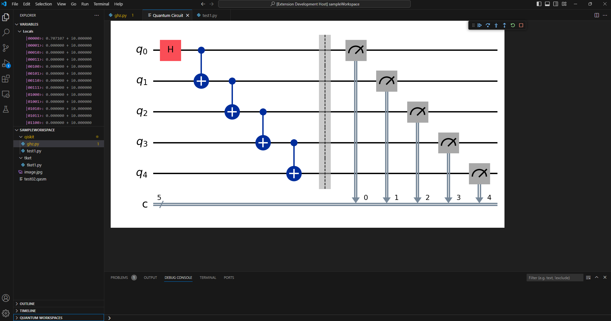

# OpenQASM debugger extension

This extension allows debugging of quantum program written in OpenQASM or one of python frameworks - [Qiskit](https://www.ibm.com/quantum/qiskit) or [TKET](https://www.quantinuum.com/developers/tket).

**OpenQASM** debugger connects to remote Quantum Virtual Machine (QVM) using [Debug Adapter Protocol](https://microsoft.github.io/debug-adapter-protocol).

It supports *step*, *continue*, *breakpoints*, *exceptions*, and
*variable access*.

Program in OpenQASM executed step by step on remote QVM and its state shown in VS Code in 'Variables' window.
Program in python which uses Qiskit or TKET frameworks loaded to QVM and converted to OpenQASM code.
This OpenQASM code can be views in 'Disassembly' window.

Using commands it is possible to render Qiskit and TKET circuits directly in VS Code (Qiskit) or in external browser (TKET).

*These commands can be used only after starting debugging session.*

More information about quantum debugger adapter can be found
[here](https://quantag-it.com/quantum/#/debugger).

Samples can be downloaded from [here](https://quantag-it.com/pub/qdb/qasm-samples.zip).

Detailed documentation of extension can be downloaded as PDF from [here] (https://quantag-it.com/pub/qdb/QSextensionDocs.pdf)

## Using OpenQASM debugger

* Install the **OpenQASM** extension in VS Code.
* Open OpenQASM or python scripts which uses Qiskit or TKET.
* Switch to the debug viewlet and press the gear dropdown.
* Select 'Debug circuit' to start debugging.

You can now 'step through' the file, set and hit breakpoints, and run into exceptions (if the word exception appears in a line).

Using command 'Render Qiskit Circuit' in Commands Palette you can render circuit directly within VS Code. 

## Build and Run

* Clone the project [https://github.com/quantag/qasm-adapter-vscode](https://github.com/quantag/qasm-adapter-vscode)
* Open the project folder in VS Code.
* Press `F5` to build and launch Debugger in another VS Code window.
* In the explorer view of the new window open the 'program' file with .qasm or .py extension
* Set some breakpoints
* From the editor's "Run and Debug" toolbar dropdown menu select "Debug Circuit"
* From Command Pallete choose 'Quantag Studio: Render Circuit' to visualize circuit in new tab.