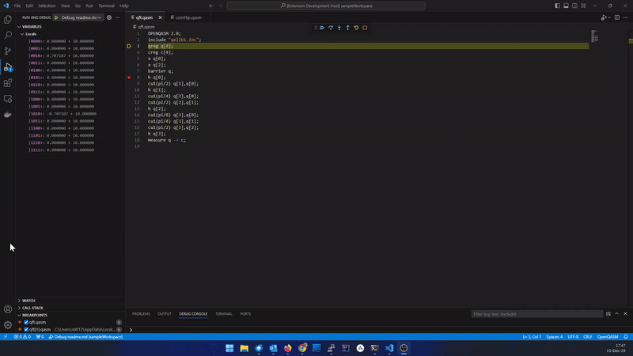

# OpenQASM debugger extension

This extension allows debugging of quantum program written in OpenQASM or one of python frameworks - [Qiskit](https://www.ibm.com/quantum/qiskit) or [TKET](https://www.quantinuum.com/developers/tket).

**Open QASM** debugger connects to remote Quantum Virtual Machine (QVM) using Debug Adapter Protocol.
It supports *step*, *continue*, *breakpoints*, *exceptions*, and
*variable access*.

Program in OpenQASM executed step by step on remote QVM and its state shown in VS Code in Variables window.
Program in python which uses Qiskit or TKET frameworks loaded to QVM and converted to OpenQASM code.
This OpenQASM code can be views in 'Disassembly' window.

More information about quantum debugger adapter can be found
[here](https://quantag-it.com/quantum/#/debugger).

Samples can be downloaded from [here](https://quantag-it.com/pub/qdb/qasm-samples.zip).

## Using OpenQASM debubber

* Install the **Open QASM** extension in VS Code.
* Open OpenQASM or python scripts which uses Qiskit or TKET.
* Switch to the debug viewlet and press the gear dropdown.
* Select the debug environment "Debug".
* Press the green 'play' button to start debugging.

You can now 'step through' the file, set and hit breakpoints, and run into exceptions (if the word exception appears in a line).

## Build and Run

* Clone the project [https://github.com/quantag/qasm-adapter-vscode](https://github.com/quantag/qasm-adapter-vscode)
* Open the project folder in VS Code.
* Press `F5` to build and launch Mock Debug in another VS Code window.
* In the explorer view of the new window open the 'program' file `readme.md`
* Set some breakpoints
* From the editor's "Run and Debug" toolbar dropdown menu select "Debug File"